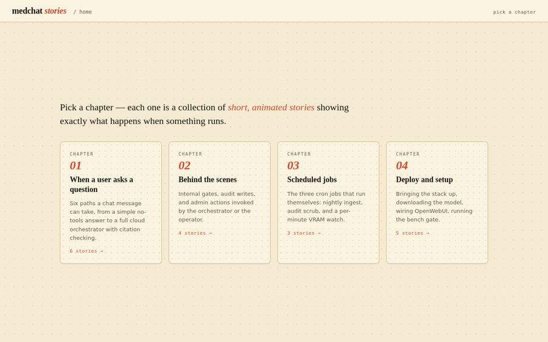
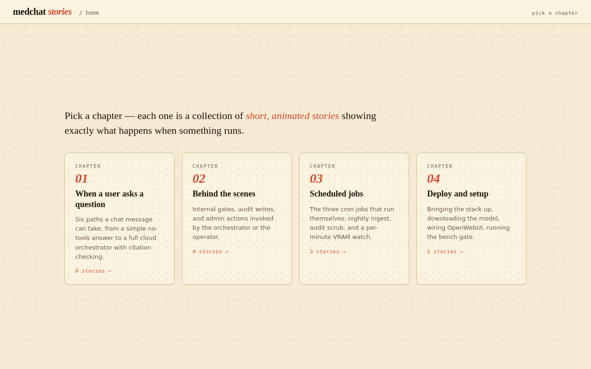
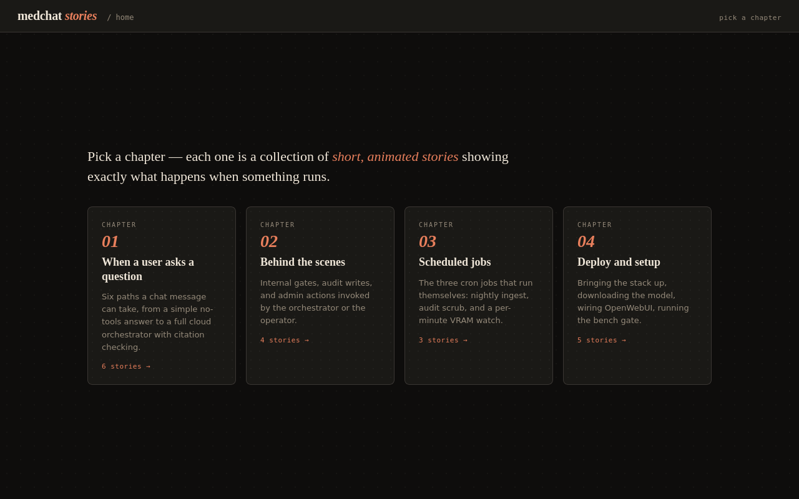
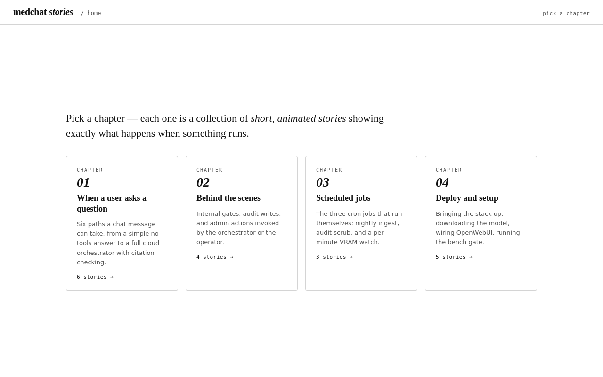
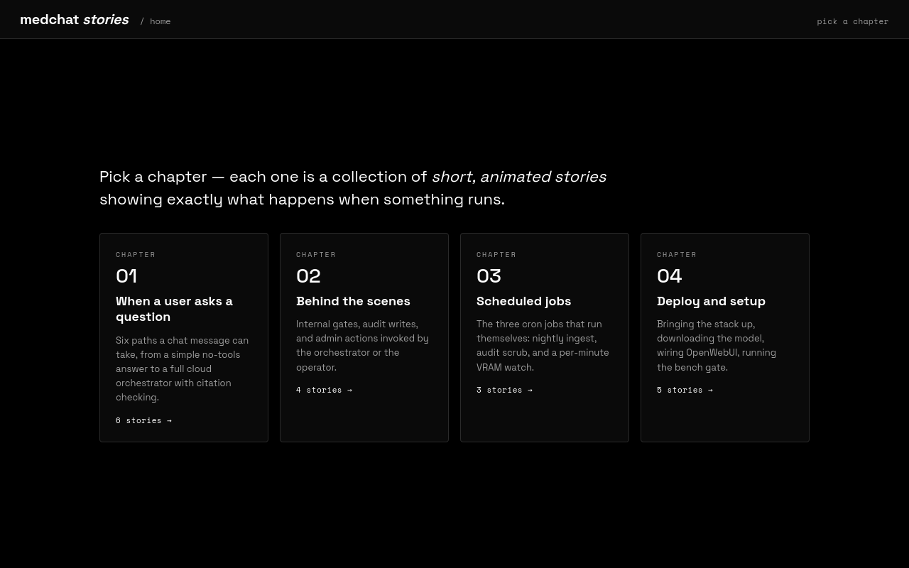

# codestory

*Turn any codebase into an animated book of workflows.*



## Install

In Claude Code, add the marketplace then install the plugin:

```
/plugin marketplace add phj6688/codestory
/plugin install codestory@codestory
```

## Use

In any repo:

```
/codestory
```

You'll be asked which theme to use (or pass `--theme dark` etc. to skip the prompt):

```
Which theme would you like?
  1) cococream         (default, warm paper)
  2) dark              (near-black, amber accent)
  3) minimal           (mono, print-friendly)
  4) nothing-design    (OLED, red interrupt)
```

Open the resulting `codestory.html` in a browser.

## Themes

| cococream | dark | minimal | nothing-design |
|---|---|---|---|
|  |  |  |  |

Pick a theme:

```
/codestory theme dark
```

## See it on real code

- [medchat](examples/medchat/) — the gold-standard flow visualisation
- [fastapi-starter](examples/fastapi-starter/) — a small FastAPI app
- [nextjs-starter](examples/nextjs-starter/) — a small Next.js app
- [django-celery](examples/django-celery/) — Django plus async tasks

## How it works

codestory reads a repo, runs scripted discovery on the code (entry points, route handlers, side-effect calls), emits a typed JSON `flows.json`, and renders a single self-contained HTML file. Every flow step cites `file:line`. Unknowns are marked, not invented. Read more in [docs/DISCOVERY.md](docs/DISCOVERY.md).

## Contribute

See [docs/CONTRIBUTING.md](docs/CONTRIBUTING.md).

## Credits

- Flow-visualisation pattern derived from the `medchat` source artefact.
- `nothing-design` theme inspired by the Nothing design language skill.

## License

MIT — see [LICENSE](LICENSE).
